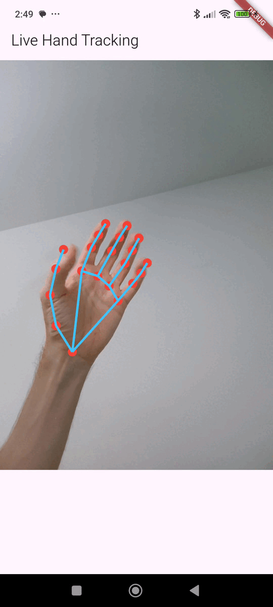

# Flutter MediaPipe Hand Tracking



A Flutter project that demonstrates live hand landmark detection using Google's MediaPipe Hand Landmarker task on Android, bridged to Flutter using `jni` and `jnigen`.

This repository serves as a **proof-of-concept** and a starting point for developers looking to integrate native Android ML libraries into their Flutter applications, specifically for functionalities not yet available through official Flutter plugins.

## Plugin information
This project is not a complete plugin but rather a demonstration of how to use MediaPipe's hand tracking capabilities in a Flutter app. It provides a working example of how to call native Android code from Flutter using JNI and JNIgen, and how to render the results in the Flutter UI.

A plugin has been created to make it easier to use this code in your own projects. You can find the plugin at [hand_landmarker](https://pub.dev/packages/hand_landmarker).

<br/>

## 🌟 Features

* **Live Hand Tracking**: Performs real-time hand detection on the camera stream.
* **21 Hand Landmarks**: Detects and renders all 21 key points of the hand.
* **Native Performance**: Leverages the native Android MediaPipe Tasks Vision library for high-performance inference.
* **JNI Bridge**: Uses the `jni` and `jnigen` packages to facilitate communication between Flutter (Dart) and the native Android (Kotlin) code.
* **Custom Rendering**: Renders the landmarks and their connections over the camera preview using a `CustomPainter`.
* **Handles Camera Transformations**: Correctly handles camera orientation and mirroring for both front and back cameras.

## Motivation

As of now, there is no official or widely adopted plugin for Flutter that supports live hand tracking using MediaPipe or ML Kit. This project bridges that gap by demonstrating a robust method to implement this feature by calling native Android code directly from Dart.

## How It Works

The project follows a hybrid architecture where the heavy lifting of machine learning is done on the native side, and the results are rendered in the Flutter UI.

1.  **Camera Stream (Flutter)**: The Flutter `camera` plugin provides a stream of `CameraImage` frames.
2.  **Image Conversion (Flutter)**: Each `CameraImage` is in YUV format. A function in `lib/main.dart` converts the image planes into a single RGBA `ByteBuffer`, which is a format that MediaPipe can process.
3.  **JNI Bridge (Flutter -> Kotlin)**: The RGBA `ByteBuffer`, along with image dimensions, is passed to the native Kotlin code through the JNI bridge generated by `jnigen`.
4.  **Hand Detection (Kotlin)**: The `MyHandLandmarker.kt` class  on the Android side receives the image data. It uses the `com.google.mediapipe:tasks-vision` library to initialize a `HandLandmarker`  and detect the hand landmarks in the provided image.
5.  **JSON Serialization (Kotlin)**: The detection results, which consist of a list of hands, each with 21 landmarks (x, y, z coordinates), are serialized into a JSON string.
6.  **Return to Flutter (Kotlin -> Flutter)**: The JSON string is returned to the Flutter app as the result of the JNI method call.
7.  **Parsing and Rendering (Flutter)**: Back in Flutter, the JSON string is parsed into a Dart `List`. A `CustomPainter` (`LandmarkPainter`) then uses this data to draw the landmarks and connections on the screen, correctly overlaying them on the camera preview.

## 🚀 Getting Started

### Prerequisites

* Flutter SDK (v3.8.1 or higher)
* An Android device or emulator (The project targets a minimum SDK version of 24 ).
* Android development environment (Android Studio, NDK).

### Installation & Setup

1.  **Clone the Repository**
    ```sh
    git clone [https://github.com/your-username/flutter-mediapipe-hand-tracking.git](https://github.com/IoT-gamer/flutter-mediapipe-hand-tracking.git)
    cd flutter-mediapipe-hand-tracking
    ```

2.  **Download the MediaPipe Model**
    This project requires the `hand_landmarker.task` model file from MediaPipe.
    * Download the model from [Google for Developers](https://developers.google.com/mediapipe/solutions/vision/hand_landmarker/index#models).
    * Create a new directory: `android/app/src/main/assets/`.
    * Place the downloaded `hand_landmarker.task` file inside this `assets` directory. This path is required by the native Kotlin code.

3.  **Install Flutter Dependencies**
    ```sh
    flutter pub get
    ```
4. **Build the apk**
    ```sh
    flutter build apk --debug
    ```
    This command will compile the Flutter app and prepare it for running on an Android device.

5.  **Generate JNI Bindings**
    This command reads the `jnigen.yaml` configuration and generates the Dart-to-Kotlin bridge code (`lib/hand_landmarker_bindings.dart`).
    ```sh
    flutter pub run jnigen --config jnigen.yaml
    ```
    You need to re-run this command whenever you change the public API of the native Kotlin classes specified in `jnigen.yaml`.

6.  **Run the App**
    ```sh
    flutter run
    ```

## Project Structure
```plaintext
.
├── android
│   └── app
│       ├── build.gradle.kts           # Android dependencies (MediaPipe) 
│       └── src
│           └── main
│               ├── assets
│               │   └── hand_landmarker.task # You must add this file
│               └── kotlin
│                   └── ...
│                       └── MyHandLandmarker.kt # Core native detection logic 
├── lib
│   ├── main.dart                      # Main application, camera, and UI logic 
│   └── hand_landmarker_bindings.dart  # Auto-generated by jnigen, DO NOT EDIT 
├── jnigen.yaml                        # Configuration for the jnigen tool 
└── pubspec.yaml                       # Flutter dependencies (camera, jni, jnigen) 
```
## Customization

You can easily customize the hand detection parameters in `android/app/src/main/kotlin/com/example/flutter_mediapipe_hand_tracking/MyHandLandmarker.kt`:

* **Number of Hands**: Change `setNumHands(2)` to `1` if you only need to track one hand.
* **Detection Confidence**: Adjust `.setMinHandDetectionConfidence(0.5f)` to a higher value (e.g., `0.6f`) for more reliable detections, or lower for more sensitivity.
* **Delegate Selection**: Change `.setDelegate(Delegate.GPU)` for accelerated inference performace or use `.setDelegate(Delegate.CPU)`

Changes to kotlin files require re-building the apk:
```bash
flutter build apk --debug
```

In `lib/main.dart`, you can select which camera to use, number of frames to skip etc.:

* **Camera Selection**: Change the `CameraLensDirection` in the `_initializeCamera()` from `CameraLensDirection.front` to `CameraLensDirection.back` if you want to use the rear camera instead of the front camera.
* **Frame Skipping**: Adjust the `_frameProcessingInterval` variable in `_HandTrackerViewState` to control how many frames to skip for processing. For example, an interval of 2 means every second frame is processed, This can help reduce CPU usage and improve performance, especially on lower-end devices.


## License

This project is released under the MIT License. See the `LICENSE` file for details.

## Acknowledgements

* The [**`jni`**](https://pub.dev/packages/jni) and [**`jnigen`**](https://pub.dev/packages/jnigen) teams for making this Flutter-to-native communication possible.
* The Google [**MediaPipe**](https://developers.google.com/mediapipe) team for providing the powerful hand landmark detection model.